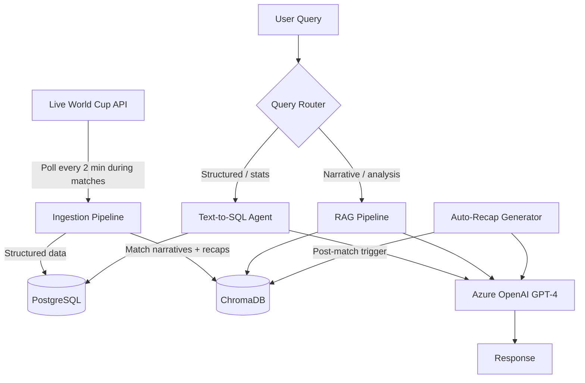

# Mundial IQ - AI World Cup 2026 Analyst

> Natural language analytics engine for the 2026 FIFA World Cup. Ask anything. Get answers backed by live tournament data.


---

## What It Does

Mundial IQ is a live AI analyst for the 2026 FIFA World Cup - the first-ever 48-team tournament, hosted across the US, Canada, and Mexico.

Ask questions in plain English. The system routes your query to the right retrieval strategy and returns AI-generated answers grounded in real match data.

**Structured queries** → text-to-SQL against live PostgreSQL
```
"Which teams have scored the most goals in group stage?"
"How many yellow cards has Argentina received?"
"Show me all matches played at MetLife Stadium."
```

**Narrative queries** → RAG over ChromaDB match embeddings
```
"What's been the biggest upset of the tournament so far?"
"How has Morocco's form looked in the group stage?"
"Give me a recap of today's matches."
```

---

## Architecture



---

## Tech Stack

| Layer | Technology |
|---|---|
| Data Source | [Free WC26 API](https://worldcup26.ir) - live scores, fixtures, standings, teams |
| Structured Storage | PostgreSQL 16 |
| Vector Storage | ChromaDB |
| Embeddings | Azure OpenAI `text-embedding-3-large` |
| LLM | Azure OpenAI GPT-4 |
| Backend | FastAPI |
| Frontend | Streamlit |
| Deploy | Railway |

---

## Key Engineering Decisions

**Why dual retrieval?**
Statistical questions ("top scorers") need exact SQL against structured data. Analytical questions ("who's been most dominant?") need semantic search over narrative context. A single retrieval strategy serves neither well — the router picks the right one at query time.

**Smart polling strategy**
The ingestion pipeline polls the live API frequently during active match windows and backs off between matches. This keeps data fresh when it matters without hammering the API unnecessarily.

**Incremental deduplication**
The tournament progresses continuously. Rather than full reloads, the pipeline tracks match state and applies incremental updates with dedup logic — critical for maintaining data integrity as scores and stats evolve mid-match.

**Auto-recap generation**
When a match transitions to `FT` (full time), a post-match trigger fires, feeds the structured result into GPT-4, and stores a natural language recap in ChromaDB. This gives the RAG layer rich narrative context to draw from, not just raw numbers.

---

## Project Structure

```
mundial-iq/
├── ingestion/
│   ├── pipeline.py          # Main ingestion loop with smart polling
│   ├── deduplicator.py      # Incremental update logic
│   └── recap_generator.py   # Post-match AI recap trigger
├── retrieval/
│   ├── router.py            # Query classification + routing
│   ├── text_to_sql.py       # LLM → SQL → Postgres
│   └── rag.py               # ChromaDB retrieval + GPT-4 synthesis
├── api/
│   └── main.py              # FastAPI app
├── frontend/
│   └── app.py               # Streamlit UI
├── db/
│   └── schema.sql           # PostgreSQL schema
└── README.md
```

---

## Local Setup

```bash
# Clone and install
git clone https://github.com/YOUR_USERNAME/mundial-iq.git
cd mundial-iq
pip install -r requirements.txt

# Configure environment
cp .env.example .env
# Add: AZURE_OPENAI_KEY, AZURE_OPENAI_ENDPOINT, POSTGRES_URL

# Initialize database
psql -f db/schema.sql

# Start ingestion
python ingestion/pipeline.py

# Start API
uvicorn api.main:app --reload

# Start frontend
streamlit run frontend/app.py
```

---

## Status

- [ ] PostgreSQL schema + ingestion pipeline
- [ ] ChromaDB setup + match embedding
- [ ] Text-to-SQL query pipeline
- [ ] RAG query pipeline
- [ ] Query router
- [ ] Auto-recap generator
- [ ] FastAPI endpoints
- [ ] Streamlit frontend
- [ ] Railway deployment

---

## Related Projects

- [Demagh](https://github.com/YOUR_USERNAME/demagh) — Egyptian Arabic Wordle with custom Unicode engine (Redis, Node.js, PostgreSQL)

---

*Built during the 2026 FIFA World Cup. Data sourced from the open-source [worldcup26.ir API](https://github.com/rezarahiminia/worldcup2026).*
